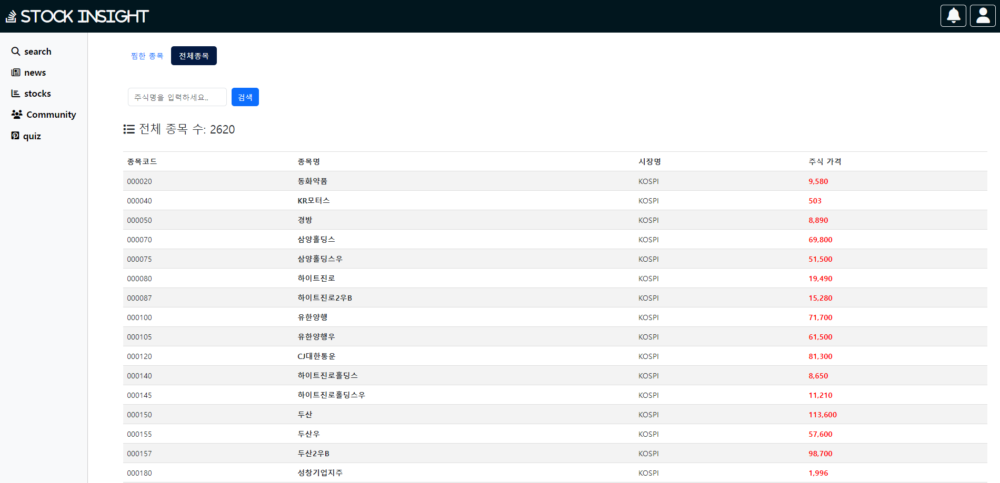
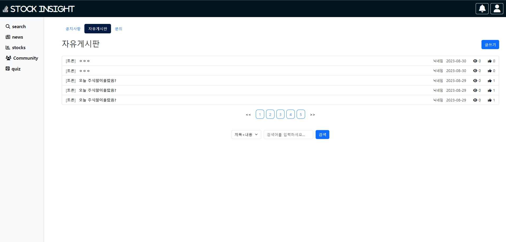
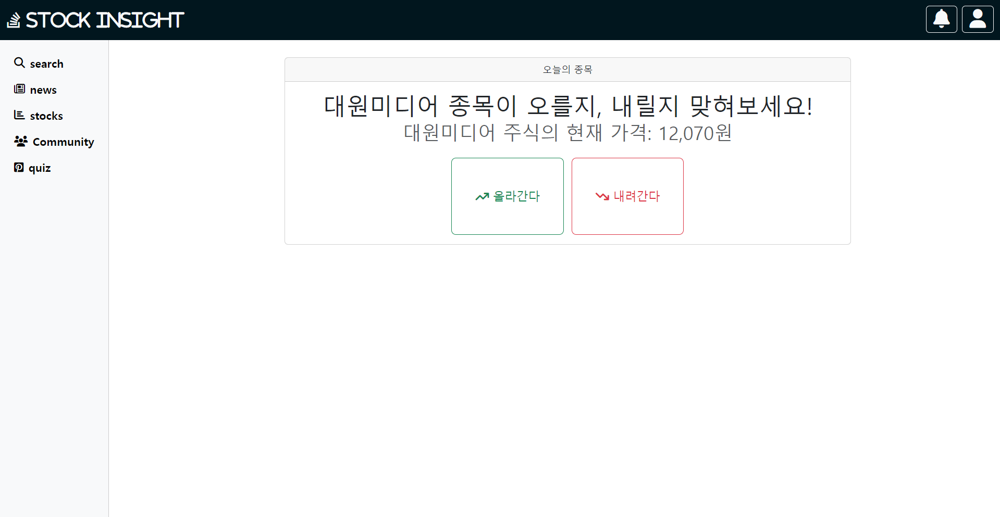
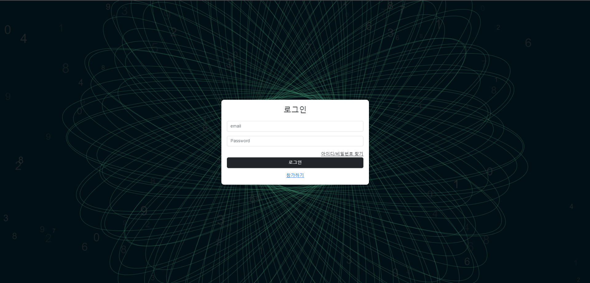
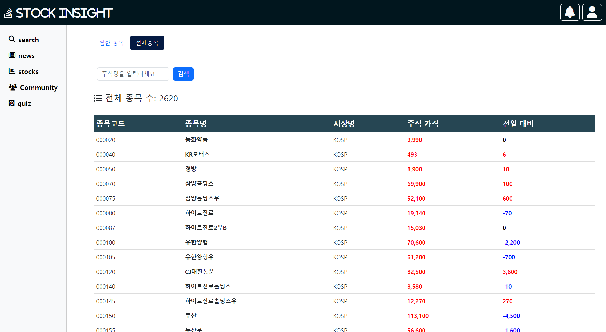
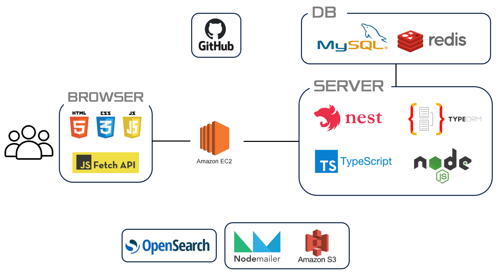
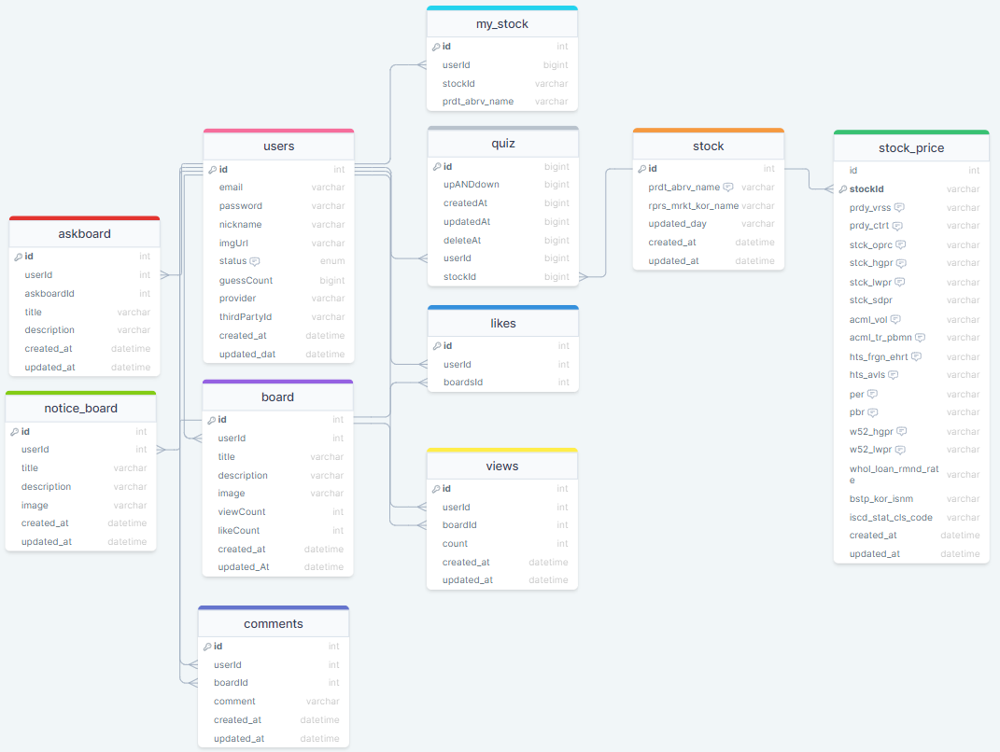

## 📌 목차

- [프로젝트 소개](#프로젝트-소개)
- [주요 기능](#주요-기능)
- [사이트 둘러보기](#사이트-둘러보기)
- [시연 영상](#시연-영상)
- [기술적 의사결정](#기술적-의사결정)
- [트러블슈팅](#트러블슈팅)
- [서비스 아키텍쳐](#서비스-아키텍쳐)
- [프로젝트 구조](#프로젝트-구조)
- [팀원 소개](#팀원-소개)
  <br>
  <br>

# 🔥 "stock insight" 주식 정보와 커뮤니티의 만남

<br>

[](https://)
<br>
<br>

`stock insight`은 주식 투자에 관심 있는 모든 이들을 위한 정보 플랫폼입니다.
<br><br>
여기서는 다양한 주식 관련 정보를 얻을 수 있을 뿐만 아니라, <br><br> 자신의 의견과 분석을 다른 투자자들과 공유할 수 있는 커뮤니티 공간도 제공합니다.

<br>
<br>

## 💡 주요 기능

<details>
  <summary>실시간 주식 정보 조회 : 주요 지수, 개별 종목의 실시간 가격 및 차트를 제공합니다.</summary>
   <br>
  
</details>
<br>
<details>
  <summary>사용자 커뮤니티 : 주식 투자에 대한 의견, 전략, 분석을 공유하고 토론할 수 있는 공간이 있습니다.</summary>
   <br>
  
</details>
<br>
<details>
  <summary>자료실 : 투자 관련 기사, 리포트, 데이터 등의 자료를 조회할 수 있습니다.</summary>
    <br>
  
</details>
<br>

<details>
  <summary>주가 예측 : 유저는 당일의 주가 예측 퀴즈를 통해, 랭커로 진급이 가능합니다.</summary>
    <br>
  
</details>
<br>

<br>
<br>

## 👀 사이트 둘러보기

> 아래 이미지를 클릭하면 사이트로 이동됩니다.(아직 배포는 못했습니다.)

[](https://localhost:3000)

<br>
<br>

## 📽️ 시연 영상

> 아래 이미지를 클릭하면 시연 영상을 시청할 수 있습니다.

[](https://www.youtube.com/watch?v=_55dJlvUmz0)

<br>
<br>

## 👨‍⚖️ 기술적 의사결정

<details>
  <summary><b>1. Redis DB 사용 (유저: 인증번호)</b></summary>
  <div markdown="1">
    </br>
    <ul>
      <li><b>도입 배경:</b></li>
        <ul>
          <li>회원가입 시 인증번호는 일시적으로만 필요한 정보입니다. 대부분의 사이트에서는 이러한 인증번호에 시간 제한을 두고, 그 시간이 지나면 인증번호는 무효화됩니다.</li>
          <li>관계형 데이터베이스에 이러한 일시적이고 소멸성을 가진 데이터를 영구적으로 저장하는 것은 부적합하다고 생각하였습니다.</li>
          <li>쿠키를 사용하는 방식도 고려했으나, 쿠키는 클라이언트 사이드에 저장되기 때문에 보안 상 취약하다고 판단하였습니다.</li>
        </ul>
      <li><b>결정:</b></li>
        <ul>
          <li>Redis는 데이터의 TTL(Time-To-Live) 설정이 간단하여, 인증번호의 유효 시간을 설정하기에 적합하다고 생각했습니다. 또한, 빠른 데이터 접근 속도를 제공하기 때문에 Redis, 즉 인메모리 데이터베이스를 선택하게 되었습니다.</li>
        </ul>
    </ul>
  </div>
</details>
<br>
<details>
  <summary><b>2. 오픈서치 사용 (게시판: 엘라스틱 서치)</b></summary>
  <div markdown="1">
    </br>
    <ul>
      <li><b>도입 배경:</b></li>
        <ul>
          <li>관리하게 되는 데이터의 양이 계속 증가하면서, 주식 데이터와 관련된 다양한 데이터 (좋아요, 조회수 등)의 검색 속도가 저하되었습니다.</li>
          <li>대용량 데이터를 빠르고 정확하게 검색할 수 있는 솔루션이 필요했습니다.</li>
        </ul>
      <li><b>결정:</b></li>
        <ul>
          <li>오픈서치는 엘라스틱서치와 호환되면서 AWS 환경에서의 확장성과 관리의 편리성을 제공합니다. 이를 통해 데이터를 빠르게 검색할 수 있기 때문에 오픈서치를 사용하기로 결정하였습니다.</li>
        </ul>
    </ul>
  </div>
</details>
<br>

<details>
  <summary><b>3. 작업 스케줄링 도입 (주식)</b></summary>
  <div markdown="1">
    </br>
    <ul>
      <li><b>도입 배경:</b></li>
        <ul>
          <li>주식 정보를 실시간으로 제공하고자 했으나, 사용하려던 오픈API에는 1초당 20건 요청의 제한이 있었습니다.</li>
          <li>제한된 요청량으로 모든 사용자에게 실시간 주식 정보를 제공하기에는 어려움이 있었습니다.</li>
        </ul>
      <li><b>결정:</b></li>
        <ul>
          <li>주기적으로 주식 정보를 수집하고, 그 정보를 기반으로 사용자에게 서비스를 제공하는 스케줄링 방식을 도입하였습니다. 10분에 1번씩 오픈 API에 요청을 하여 DB로 데이터를 가져와서, 사용자에게 실시간 정보를 제공하게 되었습니다.</li>
        </ul>
    </ul>
  </div>
</details>
<br>

## 🕵️‍♂️ 트러블슈팅

<br>
<details>
  <summary><b>1. 엘라스틱서치 정보 수집 문제 (게시판: 엘라스틱 서치)</b></summary>
  <div markdown="1">
    </br>
    <ul>
      <li><b>배경:</b></li>
        <ul>
          <li>프로젝트 초기에는 엘라스틱서치를 사용하여 데이터 검색 기능을 구현하려 했습니다. 그러나 엘라스틱서치의 공식 홈페이지와, Nest.js 문서에서도 관련 정보가 많이 부족했습니다.</li>
        </ul>
      <li><b>문제:</b></li>
        <ul>
          <li>적절한 문서나 가이드 없이 엘라스틱서치를 세팅하고 사용하는 것은 시간적 비효율 및 잠재적인 오류 발생 가능성이 있었습니다.</li>
        </ul>
      <li><b>해결:</b></li>
        <ul>
          <li>AWS에서 제공하는 오픈서치 서비스를 발견하게 되었습니다. 오픈서치는 엘라스틱서치와 호환되면서 AWS 환경에서의 관리와 세팅이 편리했습니다. 이를 도입하여 데이터를 안정적으로 색인화하고 검색하는 데 성공했습니다.</li>
        </ul>
    </ul>
  </div>
</details>
<br>
<details>
  <summary><b>2. 작업 스케줄링 중복 실행 문제 (주식: 스케줄링)</b></summary>
  <div markdown="1">
    </br>
    <ul>
      <li><b>배경:</b></li>
        <ul>
          <li>주식 정보를 주기적으로 업데이트하기 위한 작업 스케줄링을 도입했습니다. 이 스케줄링은 서버 실행 시 자동으로 시작되도록 설정되어 있었습니다.</li>
        </ul>
      <li><b>문제:</b></li>
        <ul>
          <li>개발 중, 여러 팀원이 서버를 동시에 실행하는 상황에서 스케줄링 작업이 중복 실행되는 현상이 발견되었습니다. 이로 인해 불필요한 API 호출이 중복되어 발생하고, 데이터의 중복성 및 불일치 문제가 예상되었습니다.</li>
        </ul>
      <li><b>해결:</b></li>
        <ul>
          <li>동적 스케줄링 방식을 도입하여 서버 시작 시 자동으로 스케줄링이 실행되지 않도록 조정했습니다. 대신, 명시적으로 스케줄링을 시작하거나 멈추는 커맨드를 통해 스케줄링을 제어할 수 있게 하였습니다. 이로써 중복 실행 문제를 해결하였습니다.</li>
        </ul>
    </ul>
  </div>
</details>
<br>

## ⚙️ 서비스 아키텍처

<br>

<p>기술스팩과, 아키텍쳐를 같이 표현해놓았으나, 추후 수정 예정입니다.</p>

## ⚒️ 설계

<details>
  <summary>ERD</summary>  
  <br>
  
</details>
<br>
<details>
  <summary>API 설계</summary>  
  <br>
</details>

<br>

## 🗂 프로젝트 구조

<details>
  <summary><b>Back-End (Nest.js) || front-End (javascript) </b></summary>
  
```html
📦src
 ┣ 📂askboards             # 문의게시판
 ┣ 📂auth                  # 인증                             
 ┣ 📂boards                # 자유게시판
 ┣ 📂comments              # 댓글
 ┣ 📂common                # 공통
 ┣ 📂events                # 이벤트
 ┣ 📂exception             
 ┣ 📂likes                 # 좋아요
 ┣ 📂noticeboards          # 공지게시판
 ┣ 📂quiz                  # 퀴즈
 ┣ 📂search                # 검색
 ┣ 📂socket-client         # 소켓
 ┣ 📂static                # 프론트 js
 ┣ 📂stock                 # 주식
 ┣ 📂upload                # s3
 ┣ 📂users                 # 유저
 ┣ 📂view                  # 프론트 html
 ┣ 📂views                 # 조회수
 ┣ 📂template              
 ┣ 📂test
 ┃ ┣ 📂                                       
 ┣ 📜app.controller.ts
 ┣ 📜app.module.ts
 ┣ 📜app.service.ts
 ┗ 📜main.ts     
``` 
</details>
<br>

## 👨‍👨‍👧‍👦 팀원 소개

<br>
<br>

|   |  |  |  |
| :------------------------------------------: | :-----------------------------------------: | :-----------------------------------------: | :-----------------------------------------: |
|                  **우성원**                  |                 **이승원**                  |                 **최성구**                  |                 **김연범**                  |
|   [🔗Github](https://github.com/wdevelope)   |   [🔗Github](https://github.com/tomeee11)   |  [🔗Github](https://github.com/gwagbyeol)   |  [🔗Github](https://github.com/yeonbeom14)  |
| [📝Blog](https://woo-developer.tistory.com/) |    [📝Blog](https://velog.io/@hajinpapa)    |    [📝Blog](https://velog.io/@gwagbyeol)    |    [📝Blog](https://velog.io/@dusqja14)     |
|             📧 dnqkr18@naver.com             |            📧 jsw6357@naver.com             |           📧 gwagbyeol@gmail.com            |            📧 dusqja14@naver.com            |
