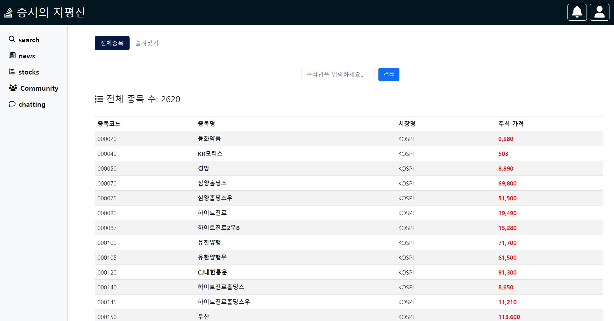

# 🔥 "증시의 지평선" 주식 정보와 커뮤니티의 만남 🔥

<br>

[](https://)

<br>
 
`증시의 지평선`은 주식 투자에 관심 있는 모든 이들을 위한 정보 플랫폼입니다.
<br><br>
여기서는 다양한 주식 관련 정보를 얻을 수 있을 뿐만 아니라, <br><br> 자신의 의견과 분석을 다른 투자자들과 공유할 수 있는 커뮤니티 공간도 제공합니다.

<br>
<br>

## 📌 목차

- [시연 영상](#)
- [주요 기능](#)
- [설계](#)
- [사이트 둘러보기](#)
- [서비스 아키텍쳐](#)
- [프로젝트 구조](#)
- [팀원 소개](#)

<br>
<br>

## 📽️ 시연 영상

> 아래 이미지를 클릭하면 시연 영상을 시청할 수 있습니다.

<br>

## 💡 주요 기능

<details>
  <summary>실시간 주식 정보 조회 : 주요 지수, 개별 종목의 실시간 가격 및 차트 제공.</summary>
   <br>
  
</details>
<br>
<details>
  <summary>사용자 커뮤니티 : 주식 투자에 대한 의견, 전략, 분석을 공유하고 토론할 수 있는 공간.</summary>
   <br>
  
</details>
<br>
<details>
  <summary>자료실 : 투자 관련 기사, 리포트, 데이터 등의 자료를 업로드 및 다운로드 할 수 있습니다.</summary>
    <br>
  
</details>

<br>

## ⚒️ 설계

<details>
  <summary>ERD</summary>  
  <br>
  
</details>
<br>
<details>
  <summary>API 설계</summary>  
  <br>
</details>

<br>

## 👀 사이트 둘러보기

[사이트로 이동하기](https://www)

[](https://)

<br>

<br>

## ⚙️ 서비스 아키텍처

<br>

## 🗂 프로젝트 구조

<details>
  <summary><b>Back-End (Nest.js) front-End (javascript) </b></summary>
  
```html
📦src
 ┣ 📂              
 ┣ 📂                
 ┣ 📂                  
 ┣ 📂           
 ┣ 📂
 ┃ ┣ 📂            
 ┃ ┣ 📂              
 ┃ ┣ 📂              
 ┃ ┗ 📂               
 ┣ 📂         
 ┣ 📂                 
 ┣ 📂                
 ┣ 📂              
 ┣ 📂              
 ┣ 📂               
 ┣ 📜app.controller.ts
 ┣ 📜app.module.ts
 ┣ 📜app.service.ts
 ┗ 📜main.ts
```
</details>
<br>

## 👨‍👨‍👧‍👦 팀원 소개
