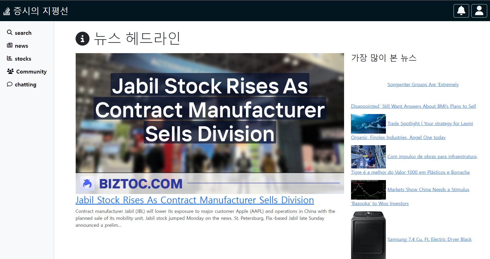

## 📌 목차

- [프로젝트 소개](#)
- [주요 기능](#)
- [사이트 둘러보기](#)
- [시연 영상](#)
- [설계](#)
- [서비스 아키텍쳐](#)
- [프로젝트 구조](#)
- [팀원 소개](#)
  <br>
  <br>

# 🔥 "stock insight" 주식 정보와 커뮤니티의 만남

<br>

[](https://)
<br>
<br>

`stock insight`은 주식 투자에 관심 있는 모든 이들을 위한 정보 플랫폼입니다.
<br><br>
여기서는 다양한 주식 관련 정보를 얻을 수 있을 뿐만 아니라, <br><br> 자신의 의견과 분석을 다른 투자자들과 공유할 수 있는 커뮤니티 공간도 제공합니다.

<br>
<br>

## 💡 주요 기능

<details>
  <summary>실시간 주식 정보 조회 : 주요 지수, 개별 종목의 실시간 가격 및 차트를 제공합니다.</summary>
   <br>
  
</details>
<br>
<details>
  <summary>사용자 커뮤니티 : 주식 투자에 대한 의견, 전략, 분석을 공유하고 토론할 수 있는 공간이 있습니다.</summary>
   <br>
  
</details>
<br>
<details>
  <summary>자료실 : 투자 관련 기사, 리포트, 데이터 등의 자료를 조회할 수 있습니다.</summary>
    <br>
  
</details>
<br>

<details>
  <summary>주가 예측 : 유저는 당일의 주가 예측 퀴즈를 통해, 랭커로 진급이 가능합니다.</summary>
    <br>
  
</details>
<br>

<br>
<br>

## 👀 사이트 둘러보기

> 아래 이미지를 클릭하면 사이트로 이동됩니다.

[](https://localhost:3000)

<br>
<br>

## 📽️ 시연 영상

> 아래 이미지를 클릭하면 시연 영상을 시청할 수 있습니다.

[](https://)

<br>
<br>

## 👨‍⚖️ 기술적 의사결정

## 🕵️‍♂️ 트러블슈팅

## ⚙️ 서비스 아키텍처

<br>


## ⚒️ 설계

<details>
  <summary>ERD</summary>  
  <br>
  
</details>
<br>
<details>
  <summary>API 설계</summary>  
  <br>
</details>

<br>

## 🗂 프로젝트 구조

<details>
  <summary><b>Back-End (Nest.js) || front-End (javascript) </b></summary>
  
```html
📦src
 ┣ 📂askboards   
 ┣ 📂auth                                              
 ┣ 📂boards                    
 ┣ 📂comments           
 ┣ 📂common
 ┣ 📂events
 ┣ 📂exception
 ┣ 📂likes
 ┣ 📂noticeboards
 ┣ 📂quiz
 ┣ 📂search
 ┣ 📂socket-client
 ┣ 📂static      
 ┣ 📂stock
 ┣ 📂upload
 ┣ 📂users
 ┣ 📂view          
 ┣ 📂views
 ┣ 📂template
 ┣ 📂test
 ┃ ┣ 📂            
 ┃ ┣ 📂              
 ┃ ┣ 📂              
 ┃ ┗ 📂                              
 ┣ 📜app.controller.ts
 ┣ 📜app.module.ts
 ┣ 📜app.service.ts
 ┗ 📜main.ts     
``` 
</details>
<br>

## 👨‍👨‍👧‍👦 팀원 소개

<br>
<br>

|            |       |        |         |
| :------------------------------------------: | :-------------------------------------: | :--------------------------------------: | :---------------------------------------: |
|                  **우성원**                  |               **이승원**                |                **최성구**                |                **김연범**                 |
|   [🔗Github](https://github.com/wdevelope)   | [🔗Github](https://github.com/tomeee11) | [🔗Github](https://github.com/gwagbyeol) | [🔗Github](https://github.com/yeonbeom14) |
| [📝Blog](https://woo-developer.tistory.com/) |  [📝Blog](https://velog.io/@hajinpapa)  |  [📝Blog](https://velog.io/@gwagbyeol)   |   [📝Blog](https://velog.io/@dusqja14)    |
|             📧dnqkr18@naver.com              |             📧lee@email.com             |             📧choi@email.com             |              📧kim@email.com              |
